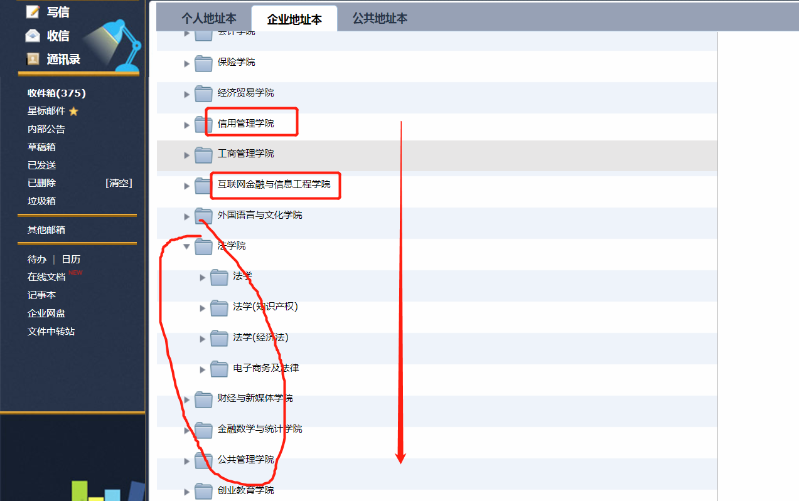
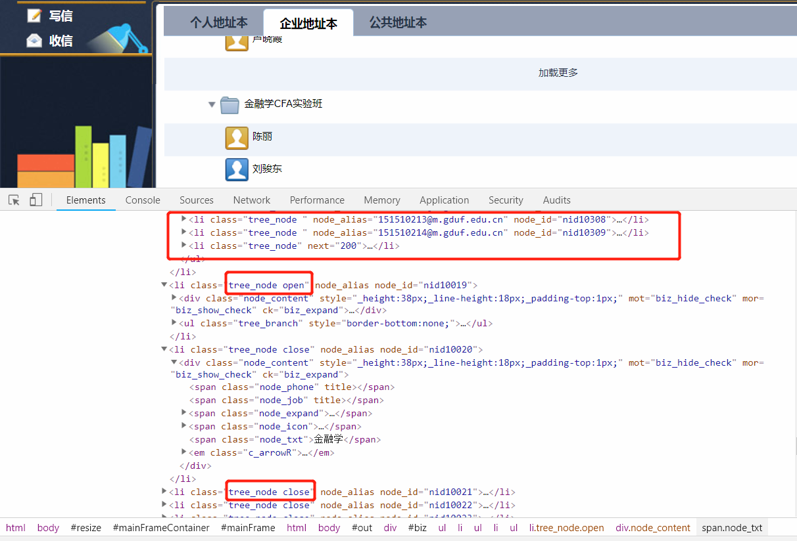
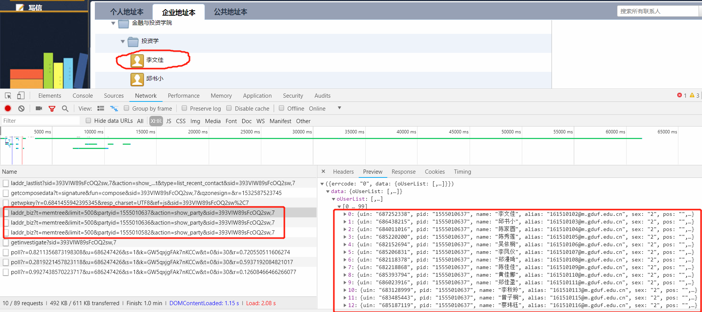
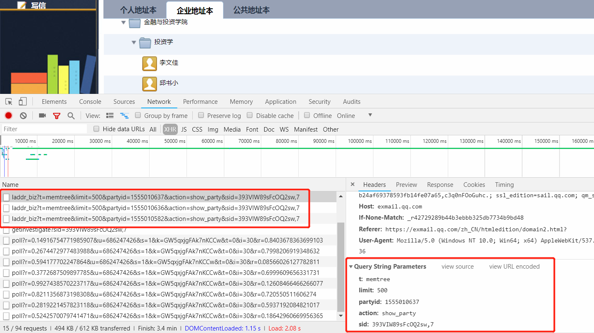
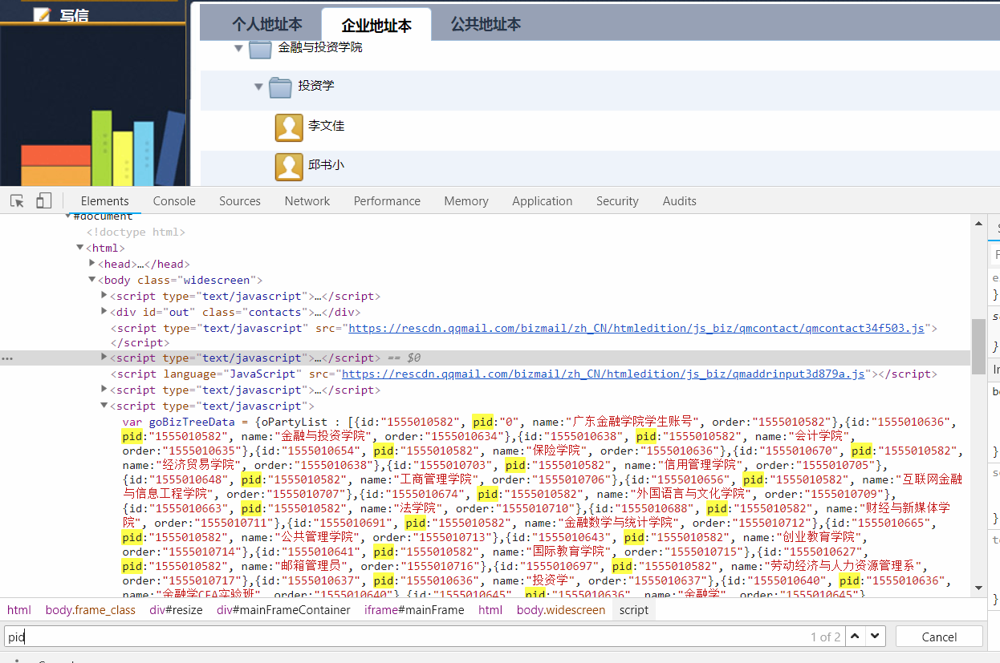
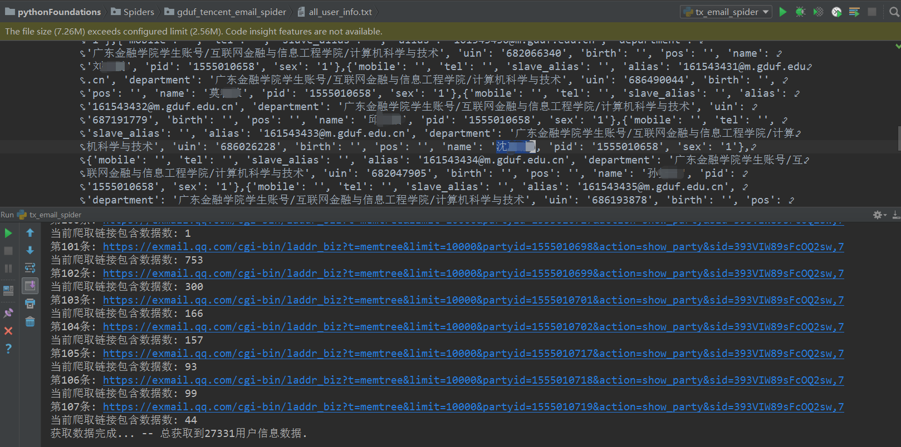

# 爬取校内腾讯企业邮箱通信录

简单使用python ``request`` + ``re`` 爬取校内邮箱通信录的用户信息数据。

### 一、分析需要爬取的数据

通过手动打开浏览器，正常访问网站，判断需要爬取的数据是静态还是动态数据，制定不同的爬取方案。

#### 1. 静态/动态 数据类型判断

登陆企业校内邮箱，可以看到需要获取的内容主要呈现在该页面:<br>


``F12``打开控制台，查看``Elements``，可以很容易发现，用户数据在目录节点没有展开的情况下，html文档中并不会包含我们需要的数据，当点击展开目录节点后，才能获取到数据。<br>

因此，可以判断，我们需要爬取的数据是动态生成的，可以初步认为是通过``AJAX``异步请求来从服务器端获取数据的。

#### 2. 数据定位

我们已经知道了需要爬取的数据是动态生成的，这时，同样``F12``打开控制台，到``Network``栏目下，查找类型为``XHR``(AJAX的请求链接)的请求链接，并按数据文件大小从到小排序，再次刷新页面，点击通讯录栏目，展开到具体的用户项，依次点击``XHR``以确定需要的数据是通过哪个链接获取的：<br>


可以看到，请求链接格式为:``https://exmail.qq.com/cgi-bin/laddr_biz?t=memtree&limit={limit}&partyid={pid}&action=show_party&sid={sid}``,参数有 - <br />

|Argument|Description|
|:---:|:-----:|
|t|取值不变,``memtree``，具体含义就不管了|
|limit|链接中取值:``500``,单次获取用户的最大数量，<br>我们可以自己修改，再次发起请求来验证|
|partyid|变化值，为所属组的id,例如：<br>学生 -> 专业 -> 院系<br>学生所属专业``partyid``就是的专业的``id``,etc.|
|action|在此链接中不变，取值:``show_party``|
|sid|用户登陆后生成的``sid``值，访问过程中不变|



通过上面的分析，我们可以知道，要获取所有学生的信息，主要是在获取所有的专业的``id``后，依次作为上面链接的``partyid``来发起请求即可。

尝试在html ``Elements``文档中搜索，能够搜到相应的数据，但它也是动态生成的 - 



继续在``Network``中将过滤类型设置为``doc``同时按文件大小排序，查找包含``oPartyList``的文件 -


到此，我们所有的分析任务已经结束了，接下来只需要编写相应的爬虫程序即可。

### 二、爬虫程序设计

这里只是编写一个简单的爬虫程序，不使用IP代理，爬虫发起请求所需的``sid``通过用户自己登陆后手动获取，相应的``cookie``也是如此。

#### 1. 获取所有专业的id

上面分析提到的，要获取用户数据，主要是要先获取到用户所在的组id``partyid``。


```python
def getAllPID():
	"""
    获取所有的专业id,作为用户的pid.
    """
    sid = 'xxx'   # 用户登陆后的sid
    all_parties_url = 'https://exmail.qq.com/cgi-bin/laddr_biz?action=show_party_list&sid={sid}&t=contact&view=biz'.format(sid=sid)
    cookies = dict(...) # cookie参数和值
    request = request.get(all_parties_url,cookies=cookies)
    
    regexp = r'{id:"(\S*?)", pid:"(\S*?)", name:"(\S*?)", order:"(\S*?)"}'
    results = re.findall(regexp,text)
    all_parties_ids = []       # 所有pid
    all_parties_info = dict() # 所有组信息
    root_party = None      # 根通信组
    
    for p in results:
    	all_parties_id.append(p[0])
        party = dict(id=item[0], pid=item[1], name=item[2], order=item[3])
        all_parties_info[item[0]] = party
        if p[1] == 0 or p[1] == '0':
        	root_party = party
```

#### 2. 获取学生信息数据

依次遍历``pid``列表，构造不同的``pid``不同的链接，来获取全部的通讯录内容。

```python
def getAllUserInfo():
	...
    获取所有通讯录用户信息
    ...
    all_user_info = []  # 用于保存所有用户数据信息
    # 获取用户数据的链接
    party_user_url = 'https://exmail.qq.com/cgi-bin/laddr_biz?t=memtree&limit={limit}'\
    				'&partyid={pid}&action=show_party&sid={sid}'
    regexp = r'{uin:"(\S*?)", pid:"(\S*?)", alias:"(\S*?)", sex:"(\S*?), pos:"(\S*?)", tel:"(\S*?)",'\
    		' birth:"(\S*?)(\S*?)(\S*?)(\S*?)", slave_alias:"(\S*?)(\S*?)(\S*?)", department:"(\S*?)(\S*?)", mobile:"(\S*?)"}'
    
    for pid in all_parites_ids:
        # 依次构造不同pid的请求链接
    	url = party_user_url.format(limit=limit, pid=pid, sid=sid)
        request = requests.get(url, cookies=cookies)
        text = request.text
        results = re.findall(regexp, text)
        
        for item in results:
        	user = dict(uin=item[0], pid=item[1], name=item[2], alias=item[3], sex=item[4],
            		pos=item[5], tel=item[6],birth=item[7], slave_alias=item[8], department=item[9],
                   mobile=item[10])
         	all_user_info.append(user)
```

详细实现查看 : [查看](https://github.com/rovo98/python-learning/blob/master/web-spiders/tx_email_spider/tx_email_spider.py)

### 三、运行结果


